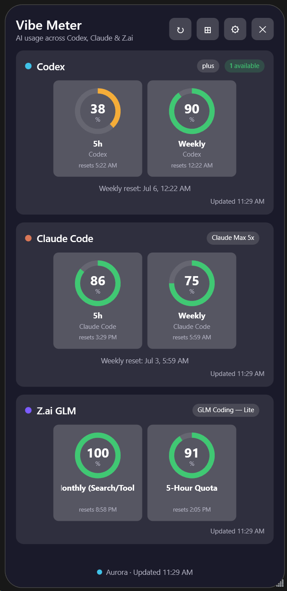

# Vibe Meter

A Windows system-tray widget that monitors **AI usage and rate limits across multiple
providers** — Codex (OpenAI) and Claude Code today, with Z.ai GLM detection — from a
single, always-on-top meter.

Each provider is a plugin implementing `IUsageProvider`; the UI binds identically no
matter the source.



## Provider status

| Provider | Status | How it reads usage |
|----------|--------|--------------------|
| **Codex** (OpenAI) | ✅ Live | `~/.codex/auth.json` → ChatGPT `wham/usage` API (5h + weekly windows) |
| **Claude** | ✅ Live | `~/.claude/usage_cache.json`, else `%APPDATA%\Claude\plan-usage-history.json` (5h + weekly, plan tier) |
| **Z.ai GLM** | ✅ Live | `api.z.ai/api/monitor/usage/quota/limit` via `ZAI_API_KEY` (5h, weekly, monthly) |
| **Google AI Pro** | ⏸ Parked | No public usage API; see [`docs/provider-research.md`](docs/provider-research.md) |

## Install

1. Download **`VibeMeter-win-x64.zip`** from the latest [Release](../../releases).
2. Extract it anywhere.
3. Run `VibeMeter.exe`.

Requirements: **Windows 10/11 x64**. The build is self-contained — no .NET runtime
install required. Sign in to [Codex](https://github.com/openai/codex) and/or
[Claude Code](https://claude.com/claude-code) on the PC, and/or set the
`ZAI_API_KEY` environment variable, for usage data to appear.

## Privacy

VibeMeter is local-first:

- It reads only local provider files (`~/.codex`, `~/.claude`) and, for Codex, calls
  OpenAI's own usage endpoint using the token the Codex CLI already stored.
- It never sends your usage data anywhere, collects no telemetry, and has no accounts.
- Claude usage is read entirely from the local files Claude already maintains (the CLI's
  usage cache or the desktop app's usage history) — no token, no network.

Settings are stored in `%APPDATA%\VibeMeter\settings.json`.

## Build from source

Requires the [.NET 10 SDK](https://dotnet.microsoft.com/download).

```powershell
dotnet build VibeMeter\VibeMeter.csproj
dotnet run --project VibeMeter\VibeMeter.csproj
```

To produce a self-contained single-file release build:

```powershell
dotnet publish VibeMeter\VibeMeter.csproj -c Release -r win-x64 -o publish
```

## Architecture

MVVM + provider plugins. Adding a provider touches only `Providers/<Name>/` plus one
line in `Services/ProviderRegistry.cs`. See `docs/provider-research.md` for the
data-source investigation behind each provider.

```
VibeMeter/
├── Core/        IUsageProvider contract + normalised ProviderUsage model
├── Models/      UI models (gauges, tint, meter style) + SettingsData
├── Providers/   One folder per provider (Codex, Claude, Zai, Google)
├── Services/    SettingsService, ProviderRegistry
├── ViewModels/  MainViewModel (aggregator), ProviderViewModel (one card), Settings
└── Views/       MainWindow (provider cards), SettingsWindow, meter controls
```

## License

[MIT](LICENSE).
